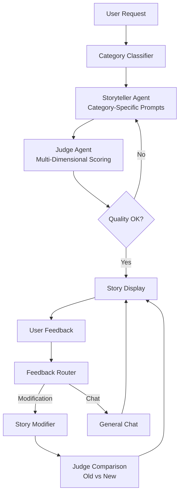

# Bedtime Story Generator

Multi-agent system for generating and refining bedtime stories for ages 5-10 using GPT-3.5-turbo.

## What I Built

**Multi-Agent Architecture**: Storyteller agent + Judge agent with LangGraph workflow management
**Category-Specific Prompting**: 7 preset genres (adventure, friendship, magical, etc.) with tailored generation strategies
**LLM Judge**: Multi-dimensional evaluation (quality, age-appropriateness, engagement, educational value, creativity)
**Interactive Feedback**: Story modifications (length, content, tone) + general chat capabilities  
**Memory Management**: Conversation state tracking with story history
**Terminal UI**: Professional formatting with Rich library

## Technical Approach

**Prompting Strategies**:
- Category classification for targeted story generation
- Chain-of-thought prompting for story structure
- Few-shot examples in category-specific templates
- Constraint-based prompting for age-appropriate content

**Agent Design**:
- Storyteller: Temperature 0.7 for creativity, category-specific system prompts
- Judge: Temperature 0.3 for consistent evaluation, JSON-structured outputs
- Classifier: Feedback routing between story modification vs general chat

**Quality Control**:
- Automatic revision cycles based on judge scores
- Modification verification comparing old/new versions
- Max 2 revisions to prevent infinite loops

## How to Use

```bash
export OPENAI_API_KEY='your-key'
pip install -r requirements.txt
python main.py
```

Enter story request → Select length → Get story → Modify/chat as needed

## Trade-off Decision

**Chose**: Preset genre classification with fixed prompting strategies
**Alternative**: Step-back prompting with autonomous agent planning (structure → genre → optimization)

**Reasoning**: GPT-3.5 struggles with multi-step agent planning(other models performed better here). Preset categories provide better quality control and consistency. More autonomous approaches failed to maintain story coherence with this model tier.

## System Flow



# Hippocratic AI Coding Assignment
Welcome to the [Hippocratic AI](https://www.hippocraticai.com) coding assignment

## Instructions
The attached code is a simple python script skeleton. Your goal is to take any simple bedtime story request and use prompting to tell a story appropriate for ages 5 to 10.
- Incorporate a LLM judge to improve the quality of the story
- Provide a block diagram of the system you create that illustrates the flow of the prompts and the interaction between judge, storyteller, user, and any other components you add
- Do not change the openAI model that is being used. 
- Please use your own openAI key, but do not include it in your final submission.
- Otherwise, you may change any code you like or add any files

---

## Rules
- This assignment is open-ended
- You may use any resources you like with the following restrictions
   - They must be resources that would be available to you if you worked here (so no other humans, no closed AIs, no unlicensed code, etc.)
   - Allowed resources include but not limited to Stack overflow, random blogs, chatGPT et al
   - You have to be able to explain how the code works, even if chatGPT wrote it
- DO NOT PUSH THE API KEY TO GITHUB. OpenAI will automatically delete it

---

## What does "tell a story" mean?
It should be appropriate for ages 5-10. Other than that it's up to you. Here are some ideas to help get the brain-juices flowing!
- Use story arcs to tell better stories
- Allow the user to provide feedback or request changes
- Categorize the request and use a tailored generation strategy for each category

---

## How will I be evaluated
Good question. We want to know the following:
- The efficacy of the system you design to create a good story
- Are you comfortable using and writing a python script
- What kinds of prompting strategies and agent design strategies do you use
- Are the stories your tool creates good?
- Can you understand and deconstruct a problem
- Can you operate in an open-ended environment
- Can you surprise us

---

## Other FAQs
- How long should I spend on this? 
No more than 2-3 hours
- Can I change what the input is? 
Sure
- How long should the story be?
You decide